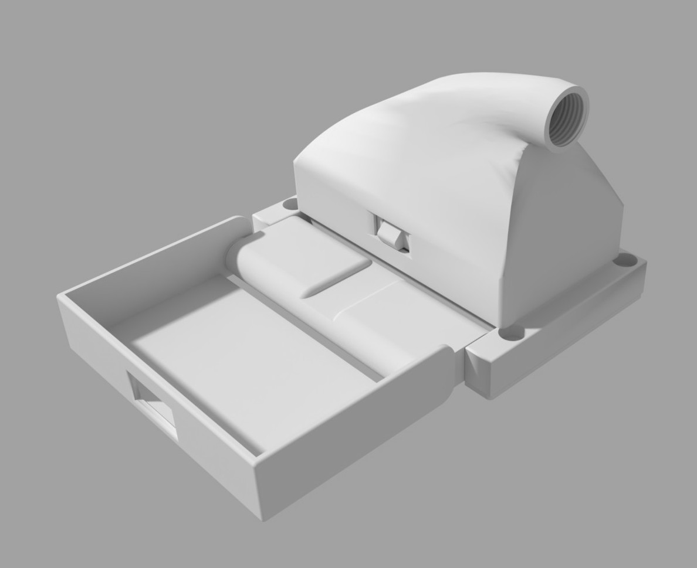
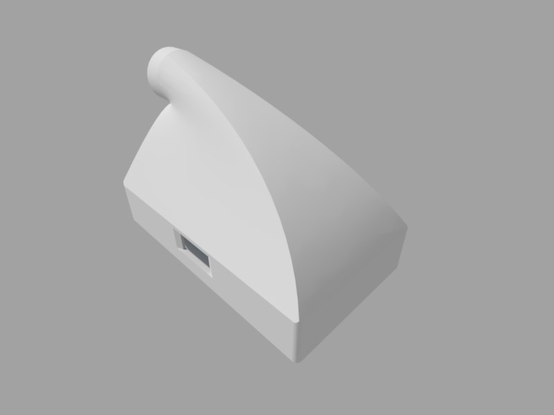
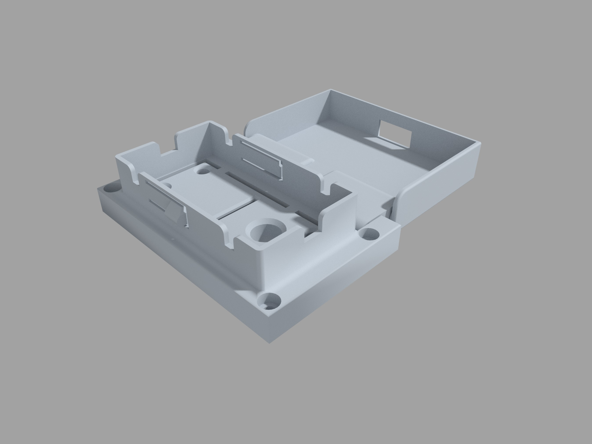
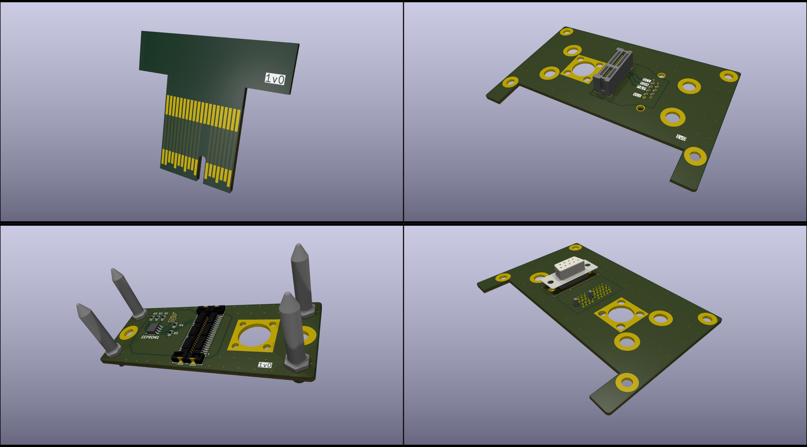

# OSI2 compatible RF Coil Connector

This connector has been primarlily developed to interface with the [OSI2 MRI LowField scanner](https://www.opensourceimaging.org/project/osii-one/). All the housing is designed to be 3D printed and the electronic boards can be manufactured by standard PCB manufacturing. Production files (e.g., Gerbers, stl, etc.) are provided as assets to the releases.

The last version of this connector features one design for the housing and for the boards. Their characteristics are described in the relevant following sections

## housing1

This housing is intended for use with one RF coil. Its shape is optimized for being eaily handed by one hand and features a locking mechanism to maintain contact in case of vibrations or minor accidental force on the cable. The system-side component provides a dust cover to protect the exposed circuitry when the RF coil is disconnected. The cover is connected to the main part of the system-side component through a hinge mechanism. The same component is supposed to be mounted on a panel that leaves access to the back part of the connector from where the cables from/to the scanner are connected. The coil-side component of the connector is made of three sub components designed to handle the connector, to secure the electronic boards and to protect the circuitry. Refer to the [assembly guide](docs/assembly-guide.md) for further information.
Four guide pins ensures the correct alignment of the coil- system-side components.

### board1

This board set features the following characteristics:
- One coaxial channel for Tx/Rx of the MR signal. This is provided by tho BNC-SMA panel adapters. Both the adapters convert a BNC to an SMA female connector supposed to be connected to the RF coil and to the Rx/Tx switch. The BNC female side is standard while the male side is a version without the Bayonet to ensure a "quick push" connection.
- Up to 36 contacts for DC or logic signals provided by an Edge Card connection.
- Implementation of the *Physical Layer* of the [MRCODS Open Standard](https://github.com/umbertozanovello/OpenStandard-CoilID/tree/main) (MRI RF Coil Open Data Standard)
- Electrically separated RF shield and Reference Ground for logical signals
- Logic and DC signals available to the scanner through a female Dsub 9 connector

## Contributors (alphabetical order)

- Nicola De Zanche
- Joshua Harper
- Jack Hayhoe
- Tri Nguyen
- Umberto Zanovello

## LICENSE
This is an open source hardware project licensed under the CERN Open Hardware Licence Version 2 - Weakly Reciprocal. For more information see the [license](./LICENSE-CERN-OHL-W) file

## CITATION
To help users correctly cite your project, a "CITATION.cff" file (read here about [citation files](https://docs.github.com/en/repositories/managing-your-repositorys-settings-and-features/customizing-your-repository/about-citation-files)) is provided with this template and can be modified according to the specific requirements.